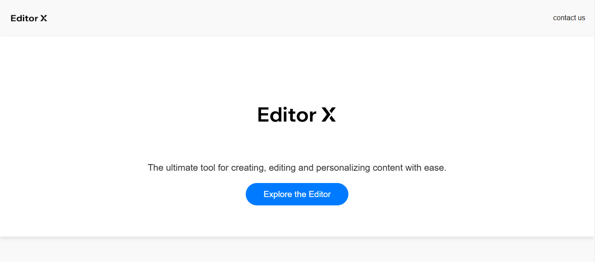
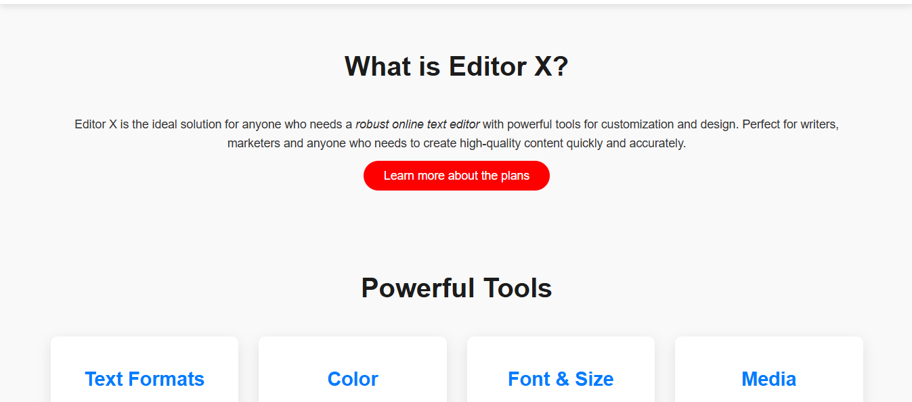
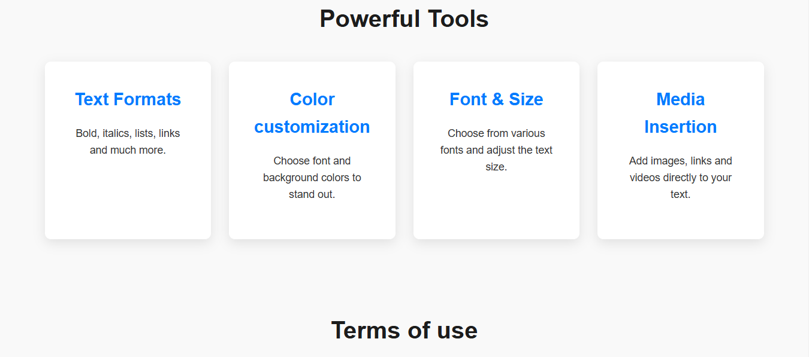
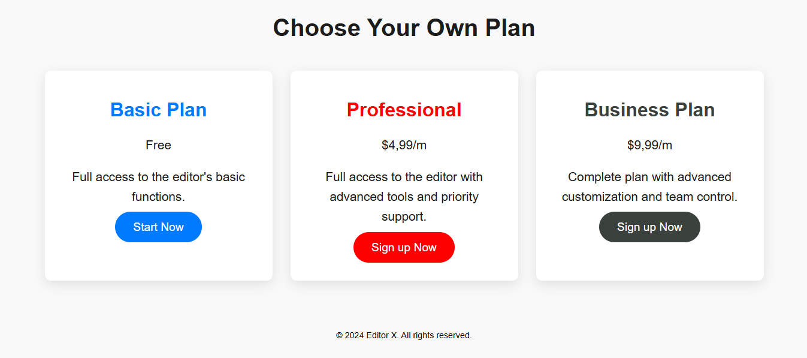
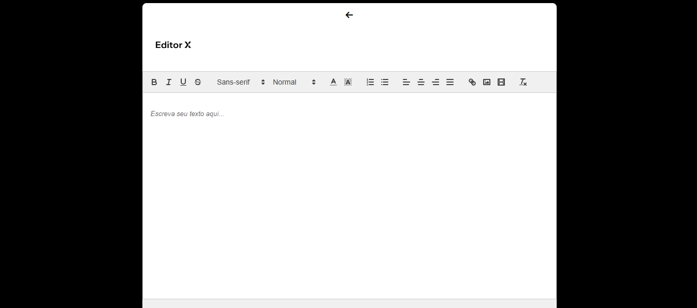

# Editor X - Rich Text Editor 📝

O **Editor X** é um editor de texto rico minimalista e profissional, projetado para oferecer uma experiência intuitiva e funcional. Este editor inclui ferramentas de decoração de texto, alinhamento, ajuste de tamanho, cor de fonte e fundo, com uma interface moderna e responsiva. Futuramente, planejamos adicionar recursos como pintura e apagador na área de digitação.

---

## 🎨 Funcionalidades

- **Decoração de texto**: negrito, itálico, sublinhado, entre outros.
- **Alinhamento**: opções de alinhamento à esquerda, direita, centralizado e justificado.
- **Personalização de fonte**: escolha de tamanho, estilo e cor.
- **Cor de fundo**: aplicação de cores ao fundo do texto.
- **Interatividade**: botões com feedback visual indicam estados ativo/inativo.
- **Interface minimalista**: ícones representativos e layout simples, ideal para uso pessoal ou profissional.
- **Suporte a extensões futuras**: pintura e apagador estão no roadmap.

---

## 🚀 Tecnologias utilizadas

- **HTML5** e **CSS3**: para a estrutura e estilização.
- **JavaScript**: para funcionalidade do editor.
- **Design Responsivo**: garantindo compatibilidade em diferentes dispositivos.

---

## 📸 Demonstração

---

## 📞 Contato

Para dúvidas ou sugestões, entre em contato
 
<a href="https://wa.me/5512988848421">WhatsApp</a>&nbsp;|&nbsp;<a href="https://www.linkedin.com/in/gustavorezendeee">LinkedIn</a>&nbsp;|&nbsp;<a href="https://www.instagram.com/rzendeee">Instagram</a>
